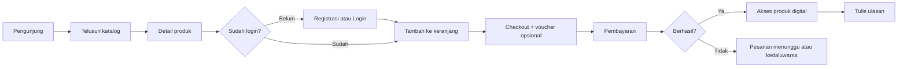

# [PRD] - Inahuy.Shop

| Field | Detail |
|---|---|
| **Author** | [Diisi oleh Anda — nama Product Manager] |
| **Status** | Draft v0.1 — **Menunggu Validasi** (validator tunggal: pemilik dokumen) |
| **Target Release** | [Diisi oleh Anda — tanggal atau kuartal] |
| **Tech Lead** | [Diisi oleh Anda — nama Software Engineer / Tech Lead] |
| **Sumber Data** | Template PRD (`.md`), ERD `Online_Shop.erdplus` (17 entitas, 15 relasi), catatan tulisan tangan |

> **Cara membaca dokumen ini**
> - Dokumen ini berisi **rekomendasi**, bukan keputusan final. Semua keputusan ada di tangan Anda; daftar keputusan yang menunggu validasi ada di **Lampiran D**.
> - Label keyakinan: **[High Confidence]** = terbaca langsung dari ERD/catatan Anda; **[Medium Confidence]** = rekomendasi berdasarkan praktik rekayasa umum; **[Low Confidence]** = tebakan terukur, butuh data tambahan.
> - **This Need Verification** = fakta eksternal (versi, regulasi, layanan pihak ketiga) yang belum saya verifikasi secara langsung.
> - Tanda ⚠ = ada ketidaksesuaian atau celah yang perlu keputusan Anda.

### Ringkasan Confidence per Bagian

| Bagian | Confidence | Dasar |
|---|---|---|
| 1. Ringkasan & Tujuan | [Medium Confidence] | Tujuan berasal dari catatan Anda; latar belakang bisnis adalah asumsi (tidak ada data pasar) |
| 2. Pengguna & User Story | [Medium Confidence] | Persona diturunkan dari entitas `customers` dan `seller` |
| 3. Persyaratan Fungsional | [High Confidence] keterlacakan ke ERD · [Medium Confidence] detail kriteria | Pemetaan ERD→FR diekstrak langsung dari file; aturan validasi adalah usulan |
| 4. Non-Fungsional | [Medium Confidence] | Praktik umum; angka target belum pernah diukur |
| 5. Out of Scope | [Medium Confidence] | Berdasarkan ketiadaan entitas di ERD |
| 6. Desain & Arsitektur | [Medium Confidence] | Backend belum ditentukan di catatan [High Confidence]; pilihan teknologinya usulan |
| 7. Metrik Keberhasilan | [Low Confidence] | Tidak ada baseline; semua angka adalah usulan |
| 8. Risiko | [Medium Confidence] | Berdasarkan temuan ERD dan stack |
| Lampiran A–C | [High Confidence] | Diekstrak dari file ERD secara terprogram, bukan dari ingatan |

---

## 1. Ringkasan & Tujuan
### Latar Belakang
Inahuy.Shop adalah platform e-commerce untuk **produk-produk digital**. Dokumen ini menurunkan kebutuhan produk dari ERD yang sudah selesai, sehingga tahap berikutnya (UI/UX → Implementasi Program) memiliki satu acuan yang konsisten.

Masalah yang dituju *(asumsi — [Medium Confidence], catatan tidak memuat data pasar/pengguna)*:
* Pembeli membutuhkan satu tempat untuk menemukan produk digital, membayar, dan menerima produknya dengan riwayat transaksi yang jelas.
* Penjual membutuhkan cara terpusat untuk mengelola katalog, harga, voucher, dan memantau pesanan.

⚠ **Catatan kritis:** ERD saat ini memuat konsep **produk fisik** (pengiriman, kurir, berat, ongkos kirim, alamat). Tidak ada entitas untuk menyerahkan produk digital kepada pembeli. Detail di Lampiran C (T-1, T-2) dan keputusan D-01 s.d. D-03.

### Tujuan
1. Pelanggan dapat menyelesaikan alur penuh: daftar → cari produk → keranjang → checkout (voucher opsional) → bayar → menerima produk → memberi ulasan.
2. Admin dapat mengelola kategori, produk (varian & gambar), voucher, serta memantau pesanan dan pembayaran.
3. Setiap fitur P0 dapat ditelusuri ke entitas ERD, dan setiap entitas ERD terpetakan ke minimal satu fitur (Lampiran A).
4. Antarmuka memenuhi WCAG (level dikonfirmasi lewat D-11) dan selaras dengan dokumen ini.
5. Dibangun dengan MySQL + HTML/CSS + Bootstrap 5.3.8 + JavaScript murni, ditambah lapisan backend (D-04).

---

## 2. Target Pengguna & User Story
### User Persona
* **Pengunjung (belum login):** Melihat katalog dan detail produk. Tidak dapat memakai keranjang karena `carts` terikat ke `customer_id`.
* **Pelanggan (`customers`):** Pembeli terdaftar yang berbelanja, membayar, melihat riwayat pesanan, dan memberi ulasan.
* **Admin / Penjual (`seller`):** Pengelola toko. *Asumsi: toko tunggal (single-store), bukan marketplace multi-penjual — lihat D-07.*

### User Stories
| ID | User Story | FR |
|---|---|---|
| US-01 | Sebagai pengunjung, saya ingin mendaftar dengan email dan nomor telepon agar bisa berbelanja. | FR-01 |
| US-02 | Sebagai pelanggan, saya ingin login dan logout agar akun saya aman. | FR-02 |
| US-03 | Sebagai pelanggan, saya ingin mengelola profil dan alamat agar data pesanan saya benar. | FR-03 |
| US-04 | Sebagai pengunjung, saya ingin menelusuri katalog per kategori dan mencari produk agar cepat menemukan yang saya butuhkan. | FR-07 |
| US-05 | Sebagai pelanggan, saya ingin melihat detail produk beserta varian, harga, gambar, dan ulasan agar bisa memilih dengan yakin. | FR-07 |
| US-06 | Sebagai pelanggan, saya ingin memasukkan varian ke keranjang dan mengubah jumlahnya agar bisa menyiapkan pembelian. | FR-09 |
| US-07 | Sebagai pelanggan, saya ingin checkout dengan kode voucher agar mendapat potongan harga. | FR-10, FR-11 |
| US-08 | Sebagai pelanggan, saya ingin membayar pesanan agar pesanan saya diproses. | FR-12 |
| US-09 | Sebagai pelanggan, saya ingin langsung mengakses produk digital yang sudah saya bayar agar bisa segera dipakai. | FR-18 |
| US-10 | Sebagai pelanggan, saya ingin melihat riwayat dan status pesanan agar tahu perkembangan pembelian saya. | FR-13 |
| US-11 | Sebagai pelanggan, saya ingin menulis ulasan atas produk yang sudah saya beli agar membantu pembeli lain. | FR-16 |
| US-12 | Sebagai admin, saya ingin login ke panel admin agar hanya saya yang bisa mengelola toko. | FR-04 |
| US-13 | Sebagai admin, saya ingin mengelola kategori, produk, varian, dan gambar agar katalog selalu terkini. | FR-05, FR-06, FR-08 |
| US-14 | Sebagai admin, saya ingin membuat dan mengakhiri voucher agar bisa menjalankan promosi. | FR-17 |
| US-15 | Sebagai admin, saya ingin memantau dan memperbarui status pesanan dan pembayaran agar operasional terkendali. | FR-14 |
| US-16 | *(Bersyarat D-02)* Sebagai admin, saya ingin mengisi data pengiriman dan pelacakan agar pelanggan bisa memantau paketnya. | FR-15 |

---

## 3. Persyaratan Fungsional
Kolom **Entitas ERD** ditambahkan dari template untuk menjaga kesesuaian PRD dengan ERD.

### 3.1 Akun & Autentikasi
| ID | Deskripsi Fitur | Prioritas | Entitas ERD | Kriteria Penerimaan (Acceptance Criteria) |
|---|---|---|---|---|
| FR-01 | Registrasi Pelanggan | P0 | `customers` | - Form menerima `first_name`, `last_name`, `email`, `phone`, password, `birth_date`<br>- `email` dan `phone` harus unik; pesan error jelas jika sudah terpakai<br>- Password disimpan sebagai hash (bcrypt/argon2), tidak pernah plaintext<br>- `created_at` terisi otomatis; `is_active` bernilai aktif secara default<br>- `age` tidak disimpan, dihitung dari `birth_date` |
| FR-02 | Login & Logout Pelanggan | P0 | `customers` | - Login memakai email + password<br>- Akun dengan `is_active` nonaktif ditolak<br>- Pesan gagal tidak membocorkan apakah email terdaftar<br>- Sesi berakhir saat logout atau kedaluwarsa<br>- Percobaan login dibatasi (rate limit) |
| FR-03 | Profil & Buku Alamat | P1 ⚠ D-02 | `customers`, `customer_address` | - Pelanggan dapat mengubah nama, telepon (tetap unik), dan password<br>- CRUD alamat: `label`, `street`, `city`, `province`, `postal_code`<br>- Maksimal satu alamat `is_default` per pelanggan<br>- ERD menetapkan tiap pelanggan memiliki ≥ 1 alamat (Mandatory); usulan: wajib diisi **sebelum checkout**, bukan saat registrasi |
| FR-04 | Login Admin | P0 | `seller` | - Autentikasi admin terpisah dari `customers`<br>- Halaman admin hanya bisa diakses setelah login admin; tanpa login → diarahkan ke halaman login<br>- Akun admin pertama dibuat lewat seeding, bukan registrasi publik |

### 3.2 Katalog & Stok
| ID | Deskripsi Fitur | Prioritas | Entitas ERD | Kriteria Penerimaan (Acceptance Criteria) |
|---|---|---|---|---|
| FR-05 | Kelola Kategori (Admin) | P1 | `categories` | - CRUD kategori; `slug` unik (dibuat otomatis dari `name`)<br>- `parent_id` opsional untuk kategori bersarang; sistem mencegah siklus (kategori menjadi induk dirinya/turunannya)<br>- Kategori yang masih memiliki produk atau sub-kategori tidak dapat dihapus |
| FR-06 | Kelola Produk, Varian & Gambar (Admin) | P0 | `products`, `product_variant`, `product_image` | - CRUD produk: `name`, `description`, `brand`, `category_id`, `is_active`<br>- Tiap produk wajib punya ≥ 1 varian (Mandatory di ERD) berisi `sku`, `variant_name`, `price`, `stock_qty`, `weight_gram`<br>- Banyak gambar per produk dengan `url` dan `sort_order`<br>- Produk yang pernah dipesan dinonaktifkan (`is_active`), bukan dihapus, agar riwayat `order_item` tetap utuh<br>- `price` > 0 dan `stock_qty` ≥ 0 divalidasi |
| FR-07 | Katalog & Detail Produk (Publik) | P0 | `products`, `categories`, `product_variant`, `product_image`, `reviews` | - Hanya produk `is_active` yang tampil; ada pagination<br>- Filter per kategori (termasuk sub-kategori) dan pencarian nama/brand<br>- Detail: deskripsi, galeri berurutan `sort_order`, pilihan varian beserta harga dan ketersediaan, rating rata-rata dan ulasan<br>- Setiap gambar memiliki teks alternatif (WCAG 1.1.1) ⚠ ERD belum punya kolom `alt_text` (Lampiran C, T-6)<br>- Dapat diakses tanpa login |
| FR-08 | Ketersediaan Stok Varian | P0 | `product_variant` | - Varian dengan `stock_qty` = 0 tidak dapat dibeli<br>- Pengurangan stok bersifat atomik dan tidak boleh menghasilkan nilai negatif saat dua pembeli memesan bersamaan<br>- Stok dikembalikan bila pesanan dibatalkan atau kedaluwarsa<br>- ⚠ Makna stok untuk produk digital (tak terbatas vs. terbatas) ditentukan di D-01 |

### 3.3 Keranjang, Checkout & Pembayaran
| ID | Deskripsi Fitur | Prioritas | Entitas ERD | Kriteria Penerimaan (Acceptance Criteria) |
|---|---|---|---|---|
| FR-09 | Keranjang Belanja | P0 | `carts`, `cart_item` | - Satu keranjang per pelanggan (relasi 1:1)<br>- Tambah varian, ubah jumlah (≥ 1 dan ≤ stok), hapus item<br>- Varian yang sama tidak membuat baris ganda (kunci komposit `cart_id` + `variant_id`); jumlah bertambah<br>- Keranjang tersimpan antar sesi; `updated_at` diperbarui<br>- Perubahan keranjang diumumkan ke pembaca layar (WCAG 4.1.3) |
| FR-10 | Checkout & Pembuatan Pesanan | P0 | `orders`, `order_item`, `customer_address` | - Pesanan dibuat dari `cart_item`; `order_number` unik (usulan format `INV-YYYYMMDD-nnnn`)<br>- Tiap `order_item` menyimpan **snapshot** `product_name_snapshot` dan `unit_price`; perubahan harga di kemudian hari tidak mengubah pesanan lama<br>- `line_total` = `unit_price` × `quantity`; `subtotal` = Σ `line_total`; `grand_total` = `subtotal` − `discount_amount` + `shipping_cost`<br>- Seluruh langkah (buat order, item, kurangi stok, kosongkan keranjang) berjalan dalam **satu transaksi database**: semua berhasil atau semua dibatalkan<br>- Semua nilai harga/total dihitung di server, bukan dipercaya dari browser<br>- Status awal: menunggu pembayaran (Lampiran E)<br>- `shipping_address_id` wajib hanya jika D-02 mengaktifkan pengiriman fisik |
| FR-11 | Voucher saat Checkout | P1 | `vouchers`, `order_vouchers` | - Kode (`code`, unik) divalidasi: belum melewati `valid_until`, subtotal ≥ `min_purchase`, pemakaian < `usage_limit`<br>- `discount_type` dan `discount_value` diterapkan; hasilnya disimpan di `order_vouchers.discount_applied` dan dijumlahkan ke `orders.discount_amount`<br>- Diskon tidak membuat `grand_total` < 0<br>- Pemakaian dihitung dari `order_vouchers` dan dicek secara atomik agar tidak melebihi `usage_limit`<br>- ERD mengizinkan banyak voucher per pesanan (N:M); usulan MVP: **maksimal 1 voucher per pesanan** ⚠ validasi<br>- Pesan penolakan menyebut alasan spesifik |
| FR-12 | Pembayaran | P0 | `payments` | - Tiap pesanan memiliki ≥ 1 record pembayaran (Mandatory di ERD), dibuat saat checkout dengan `method`, `amount` = `grand_total`, status awal `pending`<br>- Satu pesanan boleh punya beberapa percobaan pembayaran (1:N)<br>- Hasil pembayaran memperbarui `status`, `gateway_ref`, `paid_at`; keaslian callback gateway diverifikasi (D-05)<br>- Status pesanan menjadi `paid` hanya bila pembayaran sukses **dan** `amount` sama dengan `grand_total`<br>- Pembayaran kedaluwarsa → pesanan dibatalkan dan stok dikembalikan (batas waktu usulan: 24 jam) |

### 3.4 Pesanan, Pengiriman & Ulasan
| ID | Deskripsi Fitur | Prioritas | Entitas ERD | Kriteria Penerimaan (Acceptance Criteria) |
|---|---|---|---|---|
| FR-13 | Riwayat & Detail Pesanan (Pelanggan) | P0 | `orders`, `order_item`, `payments` | - Daftar pesanan milik sendiri, terbaru di atas, dengan status<br>- Detail menampilkan item (snapshot), diskon, total, dan status pembayaran<br>- Pelanggan tidak dapat membuka pesanan milik pelanggan lain (otorisasi berdasarkan `customer_id`) |
| FR-14 | Kelola Pesanan & Pembayaran (Admin) | P0 | `orders`, `order_item`, `payments` | - Daftar semua pesanan dengan filter status/tanggal dan pencarian `order_number`<br>- Detail pesanan beserta pembayarannya<br>- Perubahan status hanya mengikuti alur valid (Lampiran E); loncatan status tidak diizinkan<br>- ⚠ ERD belum memiliki jejak audit perubahan status (T-12) |
| FR-15 | Pengiriman & Pelacakan | P2 ⚠ D-02 | `shipments`, `shipment_track` | - Admin mengisi `courier`, `service_type`, `tracking_number`, `shipped_at` (relasi 1:1 dengan pesanan)<br>- Riwayat pelacakan berurutan lewat `tracking_seq` dengan `status` dan `event_time`<br>- Pelanggan melihat linimasa pelacakan di detail pesanan<br>- Rekomendasi: **tidak dibangun di MVP** bila D-01 = produk digital murni |
| FR-16 | Ulasan Produk | P1 | `reviews` | - Hanya pelanggan pemilik `order_item` pada pesanan berstatus sudah dibayar/selesai yang dapat mengulas<br>- Maksimal satu ulasan per `order_item` (relasi 1:1)<br>- `rating` skala 1–5 (usulan; ERD tidak menetapkan rentang), `comment` opsional<br>- Rating rata-rata dan daftar ulasan tampil di detail produk |
| FR-17 | Kelola Voucher (Admin) | P1 | `vouchers` | - CRUD voucher: `code` unik, `discount_type`, `discount_value`, `min_purchase`, `valid_until`, `usage_limit`<br>- Voucher yang sudah pernah dipakai tidak dihapus, hanya diakhiri lewat `valid_until` |
| FR-18 | Penyerahan Produk Digital | P0 ⚠ **Tidak ada di ERD** | *(entitas baru — D-03)* | - Setelah pembayaran sukses, pelanggan mendapat akses ke produknya (unduhan/kode/tautan, sesuai D-01) di halaman detail pesanan<br>- Akses hanya untuk pemilik pesanan dan hanya setelah pembayaran sukses<br>- Tautan unduhan bertoken dan kedaluwarsa (rekomendasi)<br>- Riwayat akses/unduh tercatat |

*Keterangan Prioritas: P0 (Wajib/Critical), P1 (Penting), P2 (Opsional/Nice-to-have).*

---

## 4. Persyaratan Non-Fungsional
*Beberapa angka default template saya ubah karena tidak realistis untuk proyek ini; alasannya dicantumkan. Semua angka adalah **usulan** dan butuh validasi Anda (D-10). [Medium Confidence]*

* **Performa:**
  * API baca sederhana (katalog, detail, keranjang) ≤ 200 ms pada beban normal (sesuai template); proses checkout ≤ 1 detik. Ukur di lingkungan deploy final, bukan hanya lokal.
  * Largest Contentful Paint halaman katalog ≤ 2,5 detik (ambang "good" Core Web Vitals) [High Confidence untuk ambang; ketercapaian di hosting Anda belum diketahui].
  * Kolom pencarian/relasi diindeks: `email`, `phone`, `slug`, `code`, `order_number`, dan semua foreign key.
* **Keamanan:**
  * Password memakai **hash satu arah (bcrypt/argon2id)**. Template menyebut AES-256 untuk "data sensitif", tetapi enkripsi dua arah tidak tepat untuk password; AES-256 relevan untuk enkripsi data-at-rest (disk/backup) bila hosting menyediakannya — *This Need Verification*.
  * HTTPS saat transit; query berparameter (cegah SQL injection); output di-escape (cegah XSS); token CSRF; cookie sesi `HttpOnly`, `Secure`, `SameSite`.
  * Otorisasi dicek **di server**, bukan sekadar menyembunyikan tombol: pelanggan hanya mengakses datanya sendiri; endpoint admin hanya untuk admin.
  * Harga dan total dihitung di server karena JavaScript di browser mudah dimanipulasi.
  * Rate limiting pada login; tautan produk digital bertoken dan kedaluwarsa.
  * Data pribadi (email, telepon, tanggal lahir, alamat) mengikuti prinsip minimisasi. UU No. 27 Tahun 2022 tentang Pelindungan Data Pribadi [High Confidence ada]; **kewajiban spesifik dan penerapannya pada proyek ini = This Need Verification**.
* **Skalabilitas:** Template menyebut 10.000 pengguna bersamaan; angka itu tidak punya dasar permintaan dan tidak realistis untuk hosting tipikal proyek portofolio/tugas. Usulan MVP: **100 pengguna aktif bersamaan**, dengan pagination dan indeks agar bisa tumbuh. [Medium Confidence]
* **Ketersediaan:** Template menyebut 99,9% (≈ 8,8 jam henti/tahun). Usulan MVP: **best-effort ≥ 99%** (≈ 3,65 hari/tahun) tanpa SLA formal. [Medium Confidence]
* **Aksesibilitas:** Target **WCAG 2.1 Level AA** (usulan; konfirmasi versi/level terhadap dokumen WCAG Anda — D-11). Kriteria kunci untuk proyek ini:
  * 1.1.1 teks alternatif gambar produk · 1.3.1 label form & struktur heading/tabel · 1.4.3 kontras teks ≥ 4,5:1 · 1.4.4 & 1.4.10 teks dapat diperbesar & reflow · 2.1.1 seluruh fungsi bisa lewat keyboard · 2.4.7 fokus terlihat · 3.3.1–3.3.3 identifikasi dan saran perbaikan error form · 4.1.2 nama/peran/nilai komponen · 4.1.3 pesan status (mis. "item ditambahkan ke keranjang") [High Confidence untuk nomor kriteria].
  * Bootstrap 5 menyediakan fondasi, **bukan jaminan kepatuhan**; warna dan komponen kustom tetap harus diuji.
  * Verifikasi: alat otomatis (axe/Lighthouse) + uji keyboard + uji pembaca layar manual; alat otomatis hanya menangkap sebagian masalah.
* **Integritas Data & Kompatibilitas:**
  * MySQL InnoDB (foreign key + transaksi), charset `utf8mb4`; nilai uang memakai `DECIMAL`, bukan `FLOAT`; foreign key riwayat pesanan memakai `RESTRICT`.
  * Timestamp disimpan konsisten (usulan UTC), ditampilkan dalam WIB; mata uang IDR; bahasa antarmuka Indonesia.
  * Browser modern terbaru (Chrome, Firefox, Edge, Safari); desain mobile-first.
  * Bootstrap 5.3.8 sesuai catatan Anda — *This Need Verification:* ketersediaan versi tepat tersebut di CDN/npm saat implementasi.

---

## 5. Batasan Cakupan (Out of Scope)
Berdasarkan ketiadaan entitas di ERD dan prinsip MVP. [Medium Confidence]

* Marketplace multi-penjual (tidak ada `seller_id` pada `products`/`orders`; `seller` berdiri sendiri).
* Pengembalian dana, retur, dan sengketa (tidak ada entitas pendukung).
* Wishlist, notifikasi email/WhatsApp, dan chat.
* Checkout tanpa akun (guest checkout).
* Login sosial, autentikasi dua faktor, dan reset password lewat email (ditunda; perlu entitas token baru).
* Integrasi API kurir otomatis dan perhitungan ongkir real-time (bila D-02 mengaktifkan pengiriman fisik, input pengiriman manual oleh admin).
* Multi-mata uang, program loyalitas, bundling produk, langganan berkala.
* Dasbor analitik dan laporan penjualan lanjutan.
* Aplikasi mobile native (cukup web responsif).
* Moderasi ulasan dan DRM tingkat lanjut untuk file digital.

---

## 6. Desain & Arsitektur
* **Tautan Figma:** [Belum ada — diisi setelah tahap UI/UX]
* **User Flow:** [Belum ada URL — usulan alur di bawah]
* **Ketergantungan Teknis:**

| Komponen | Status | Catatan |
|---|---|---|
| MySQL | Ditetapkan (catatan) | Skema dari ERD |
| HTML + CSS + Bootstrap 5.3.8 | Ditetapkan (catatan) | Versi: *This Need Verification* |
| JavaScript murni | Ditetapkan (catatan) | Berjalan di browser; memanggil API lewat `fetch()` |
| **Backend / REST API** | ⚠ **Belum ditentukan** | **Wajib ada** (lihat di bawah) |
| Payment gateway | Belum ditentukan | `payments.gateway_ref` mengisyaratkan gateway; D-05 |
| Penyimpanan file produk digital | Belum ditentukan | Bergantung D-01 dan D-03 |
| Hosting & domain | Belum ditentukan | Memengaruhi target ketersediaan |

### Arsitektur yang Direkomendasikan [Medium Confidence]
```
Browser  (HTML + CSS + Bootstrap 5.3.8 + JavaScript murni)
   │   fetch() — JSON lewat HTTPS
   ▼
Backend REST API   (kandidat: Node.js + Express  |  PHP 8 + PDO)
   │   query berparameter + transaksi
   ▼
MySQL (InnoDB, utf8mb4) — tabel sesuai ERD
   ├── Payment gateway (callback pembayaran)
   └── Penyimpanan file produk digital
```
**Mengapa backend wajib [High Confidence]:** JavaScript yang berjalan di browser tidak dapat terhubung langsung ke MySQL, dan bila dipaksa, kredensial database terbuka bagi semua pengunjung. Karena itu "JavaScript murni" hanya dapat berarti kode sisi-klien; sisi-server harus ditentukan (D-04).
**Pilihan backend [Medium Confidence]:** Node.js + Express + `mysql2` menjaga satu bahasa (JavaScript) di seluruh sistem dan paling dekat dengan semangat "JS murni". PHP 8 + PDO adalah alternatif yang sama-sama cocok dengan MySQL dan Bootstrap. Keduanya layak; pilih yang paling Anda kuasai.

### User Flow (Usulan)


### Inventaris Halaman (Acuan Tahap UI/UX)
Setiap halaman perlu memiliki state **kosong, memuat, dan error**, serta mengikuti WCAG pada Bagian 4.

| Kode | Halaman | Peran | FR |
|---|---|---|---|
| P-01 | Beranda & katalog (filter, pencarian) | Publik | FR-07 |
| P-02 | Detail produk (galeri, varian, ulasan) | Publik | FR-07, FR-16 |
| P-03 | Registrasi | Publik | FR-01 |
| P-04 | Login | Publik | FR-02 |
| P-05 | Keranjang | Pelanggan | FR-09 |
| P-06 | Checkout (alamat bila D-02, voucher) | Pelanggan | FR-10, FR-11, FR-03 |
| P-07 | Pembayaran / status pembayaran | Pelanggan | FR-12 |
| P-08 | Riwayat pesanan | Pelanggan | FR-13 |
| P-09 | Detail pesanan (+ akses produk digital, ulasan, pelacakan bila D-02) | Pelanggan | FR-13, FR-15, FR-16, FR-18 |
| P-10 | Profil & alamat | Pelanggan | FR-03 |
| A-01 | Login admin | Admin | FR-04 |
| A-02 | Kelola kategori | Admin | FR-05 |
| A-03 | Kelola produk (form varian & gambar) | Admin | FR-06, FR-08 |
| A-04 | Kelola voucher | Admin | FR-17 |
| A-05 | Daftar pesanan | Admin | FR-14 |
| A-06 | Detail pesanan & pembayaran (+ pengiriman bila D-02) | Admin | FR-14, FR-15 |

### Konsep Implementasi (Usulan Urutan Kerja) [Medium Confidence]
Catatan Anda menyebut konsep implementasi belum jelas; berikut kerangka sederhananya.

| Fase | Fokus | FR |
|---|---|---|
| 1 | Fondasi: buat skema MySQL dari ERD, data awal (seed), kerangka backend + koneksi DB | — |
| 2 | Autentikasi pelanggan dan admin | FR-01, 02, 04 |
| 3 | Katalog dan manajemen produk | FR-05–08 |
| 4 | Keranjang dan checkout (termasuk transaksi DB) | FR-09–11 |
| 5 | Pembayaran, pesanan, penyerahan produk digital | FR-12–14, FR-18 |
| 6 | Ulasan, voucher admin, pengujian WCAG & keamanan | FR-16, 17 |

---

## 7. Metrik Keberhasilan
*Semua target adalah usulan tanpa baseline. [Low Confidence] — validasi dan sesuaikan.*

| Metrik | Target | Cara Ukur |
|---|---|---|
| Kelengkapan fitur | 100% FR P0 lulus kriteria penerimaan | Checklist uji per FR |
| Keterlacakan ERD | 17/17 entitas terpetakan ke ≥ 1 FR | Lampiran A (saat ini terpenuhi, kecuali FR-18 yang butuh entitas baru) |
| Aksesibilitas | 0 pelanggaran WCAG AA tingkat *serious/critical* pada P-01 s.d. P-09; skor Lighthouse Accessibility ≥ 90 sebagai indikator (bukan bukti kepatuhan) | axe + Lighthouse + uji keyboard & pembaca layar manual |
| Keberhasilan checkout | ≥ 95% skenario uji normal selesai tanpa error; kegagalan transaksi teknis < 1% | Uji end-to-end |
| Efisiensi alur beli | Detail produk → pembayaran dalam ≤ 4 layar | Uji alur |
| Integritas data | 0 pesanan dengan `grand_total` ≠ `subtotal` − `discount_amount` + `shipping_cost`; 0 stok negatif; 0 pesanan tanpa item atau tanpa pembayaran | Query SQL pemeriksa |
| Performa | LCP ≤ 2,5 detik; API baca ≤ 200 ms | Lighthouse / uji beban sederhana |
| Keamanan dasar | 0 temuan tingkat tinggi pada uji manual SQL injection, XSS, dan akses data pelanggan lain | Checklist uji keamanan |

---

## 8. Risiko & Rencana Mitigasi
| Risiko Teknis / Bisnis | Dampak | Rencana Mitigasi |
|---|---|---|
| ERD bercorak produk fisik, sementara produk yang dijual digital; fitur pengiriman jadi tidak relevan dan penyerahan produk tidak punya wadah data (T-1, T-2) | Tinggi | Putuskan D-01 s.d. D-03 **sebelum** UI/UX; sesuaikan ERD atau tandai modul pengiriman sebagai non-MVP |
| Backend belum ditentukan; JS murni tidak bisa mengakses MySQL langsung | Tinggi | Tetapkan D-04 sebelum implementasi; jangan menaruh kredensial DB di kode klien |
| Payment gateway/metode bayar belum jelas; integrasi nyata butuh akun dan proses verifikasi | Tinggi | Mulai dengan mode sandbox/simulasi; keputusan D-05; verifikasi dokumentasi gateway terpilih (*This Need Verification*) |
| Kerentanan keamanan (SQL injection, XSS, IDOR, manipulasi harga dari klien) | Tinggi | Query berparameter, otorisasi di server, harga dihitung di server, checklist uji keamanan (Bagian 4 & 7) |
| Stok/voucher melampaui batas akibat transaksi bersamaan (race condition) | Sedang–Tinggi | Transaksi database dan penguncian baris/update atomik pada stok dan pemakaian voucher |
| Tautan produk digital dibagikan ke pihak lain (pembajakan) | Sedang | Token unduhan terikat pesanan, kedaluwarsa, dan dibatasi jumlah akses |
| UI tidak memenuhi WCAG karena tahap UI/UX tidak selaras dengan PRD | Sedang | Gunakan Inventaris Halaman dan kriteria WCAG Bagian 4 sebagai acuan desain; uji sejak prototipe |
| Ambiguitas ERD (4 foreign key tanpa relasi, redundansi `reviews`, `seller` terisolasi) menimbulkan skema berbeda saat dibuat jadi SQL | Sedang | Selesaikan temuan Lampiran C sebelum membuat DDL |
| Data turunan (`subtotal`, `grand_total`, `line_total`) tidak konsisten | Sedang | Hitung di server dalam satu transaksi; query pemeriksa integritas (Bagian 7); putuskan D-06 |
| Pelanggaran privasi data pribadi | Sedang | Minimisasi data, hash password, HTTPS; verifikasi kewajiban UU PDP (*This Need Verification*) |
| Cakupan membengkak (fitur di luar ERD) | Sedang | Patuhi Bagian 5; tambah fitur hanya lewat revisi PRD |

---

## Lampiran A — Keterlacakan Entitas ERD → Fitur
[High Confidence — diekstrak dari file ERD]

| # | Entitas | Tipe di ERD | FR |
|---|---|---|---|
| 1 | `customers` | Regular | FR-01, FR-02, FR-03 |
| 2 | `customer_address` | Regular | FR-03, FR-10 |
| 3 | `seller` | Regular | FR-04 |
| 4 | `categories` | Regular | FR-05, FR-07 |
| 5 | `products` | Regular | FR-06, FR-07 |
| 6 | `product_variant` | Weak | FR-06, FR-07, FR-08, FR-09 |
| 7 | `product_image` | Weak | FR-06, FR-07 |
| 8 | `carts` | Regular | FR-09 |
| 9 | `cart_item` | Associative | FR-09 |
| 10 | `orders` | Regular | FR-10, FR-13, FR-14 |
| 11 | `order_item` | Associative | FR-10, FR-13, FR-16 |
| 12 | `payments` | Regular | FR-12, FR-13, FR-14 |
| 13 | `vouchers` | Regular | FR-11, FR-17 |
| 14 | `order_vouchers` | Associative | FR-11 |
| 15 | `shipments` | Regular | FR-15 *(bersyarat D-02)* |
| 16 | `shipment_track` | Weak | FR-15 *(bersyarat D-02)* |
| 17 | `reviews` | Associative | FR-07, FR-16 |
| — | *(belum ada)* | — | FR-18 butuh entitas baru (D-03) |

### Relasi ERD dan Aturan Bisnis Turunannya
| # | Relasi | Kardinalitas | Aturan turunan |
|---|---|---|---|
| 1 | `customers` memiliki `customer_address` | 1 : N | Tiap pelanggan ≥ 1 alamat (Mandatory) |
| 2 | `customers` membuat `orders` | 1 : N | Pelanggan boleh belum punya pesanan (Optional) |
| 3 | `customers` memiliki `carts` | 1 : 1 | Satu keranjang per pelanggan |
| 4 | `carts` berisi `cart_item` | 1 : N | Identifying |
| 5 | `product_variant` masuk ke `cart_item` | 1 : N | — |
| 6 | `products` memiliki `product_variant` | 1 : N | Tiap produk ≥ 1 varian (Mandatory); identifying |
| 7 | `products` memiliki `product_image` | 1 : N | Identifying |
| 8 | `categories` induk dari `categories` | 1 : N (self) | Kategori bersarang |
| 9 | `categories` mengelompokkan `products` | 1 : N | — |
| 10 | `orders` berisi `order_item` | 1 : N | Tiap pesanan ≥ 1 item (Mandatory); identifying |
| 11 | `orders` dibayar lewat `payments` | 1 : N | Tiap pesanan ≥ 1 pembayaran (Mandatory) |
| 12 | `orders` dikirim via `shipments` | 1 : 1 | Bersyarat D-02 |
| 13 | `shipments` memiliki `shipment_track` | 1 : N | Identifying |
| 14 | `orders` memakai `vouchers` | N : M | Lewat `order_vouchers` |
| 15 | `reviews` diulas lewat `order_item` | 1 : 1 | `order_item` boleh belum diulas (Optional) |

---

## Lampiran B — Atribut Turunan & Komposit di ERD
[High Confidence]

| Entitas | Atribut | Jenis | Catatan |
|---|---|---|---|
| `customers` | `full_name` → `first_name`, `last_name` | Komposit | Disimpan sebagai dua kolom |
| `customers` | `age` | Turunan | Dihitung dari `birth_date` |
| `customer_address` | `district` → `city`, `province` | Komposit | Lihat T-11 |
| `orders` | `subtotal`, `grand_total` | Turunan | Lihat T-7 / D-06 |
| `order_item` | `line_total` | Turunan | Lihat T-7 / D-06 |

---

## Lampiran C — Temuan pada ERD (Urut dari yang Terpenting)
Ini rekomendasi; **ERD tidak saya ubah**.

| # | Temuan | Dampak | Rekomendasi | Confidence |
|---|---|---|---|---|
| T-1 | Skema bercorak produk fisik: `shipments`, `shipment_track`, `customer_address`, `weight_gram`, `shipping_cost`, `stock_qty` | Tinggi — tidak selaras dengan "produk digital" bila artinya file/kode/akses | Putuskan D-01 dan D-02. Bila digital murni: modul pengiriman dijadikan non-MVP dan ERD disesuaikan | [Medium Confidence] — pengamatan pada ERD pasti; kesimpulan bergantung definisi "produk digital" |
| T-2 | Tidak ada entitas penyerahan produk digital (file, kode lisensi, token unduhan, log akses) | Tinggi — FR-18 tidak punya penyimpanan data | Tambah minimal: aset digital per `product_variant` dan catatan penyerahan per `order_item` (token, `expires_at`, jumlah akses) | [High Confidence] bila produk berupa file/kode |
| T-3 | Empat foreign key ada sebagai atribut tetapi **tanpa relasi** di diagram: `orders.shipping_address_id`, `order_item.variant_id`, `reviews.customer_id`, `reviews.product_id` | Sedang — skema SQL bisa ditafsirkan berbeda | Gambar relasinya di ERD sebelum membuat DDL | [High Confidence] |
| T-4 | `seller` tidak punya relasi ke entitas mana pun; nama entitas (`seller`) dan kuncinya (`admin_id`) tidak konsisten | Sedang — peran admin vs penjual ambigu | Putuskan D-07; pertimbangkan nama seragam (mis. `admins`) | [Medium Confidence] |
| T-5 | `reviews` menyimpan `customer_id` dan `product_id` padahal sudah dapat diturunkan dari `order_item` | Sedang — redundansi dan risiko data tidak konsisten | Putuskan D-08: simpan hanya `order_item_id`, atau pertahankan dengan pemeriksaan konsistensi | [Medium Confidence] |
| T-6 | `product_image` tanpa kolom teks alternatif | Sedang — menyulitkan WCAG 1.1.1 | Tambah `alt_text` (atau wajibkan turunan dari nama produk) | [High Confidence] bahwa kolom tidak ada |
| T-7 | Atribut turunan (`age`, `subtotal`, `grand_total`, `line_total`) belum jelas disimpan atau dihitung | Sedang | `age`: hitung, jangan simpan. Total pesanan: usulan disimpan sebagai catatan transaksi yang dihitung server dalam satu transaksi (D-06) | [Low Confidence] — ada argumen normalisasi dan argumen riwayat finansial |
| T-8 | `cart_item` hanya menandai `cart_id` sebagai unik; `order_vouchers` tanpa penanda kunci | Rendah–Sedang | Pastikan kunci komposit: (`cart_id`, `variant_id`) dan (`order_id`, `voucher_id`) | [High Confidence] |
| T-9 | `vouchers` tanpa `valid_from`, status aktif, atau pencacah pemakaian | Rendah | Pemakaian dihitung dari `order_vouchers`; tambah `valid_from`/`is_active` bila dibutuhkan | [Medium Confidence] |
| T-10 | Nilai status/enumerasi (`orders.status`, `payments.status`, `payments.method`, `discount_type`, `shipment_track.status`) belum didefinisikan | Sedang | Lihat Lampiran E | [Medium Confidence] |
| T-11 | `district` bersifat komposit tetapi berisi `city` dan `province` — nama menyesatkan (kecamatan vs. kota); tidak ada kecamatan/kelurahan | Rendah | Ganti nama atau pecah menjadi kolom alamat eksplisit | [Medium Confidence] |
| T-12 | `orders` tanpa `updated_at` maupun riwayat perubahan status | Rendah–Sedang | Tambah `updated_at`; pertimbangkan tabel riwayat status bila audit dibutuhkan | [Medium Confidence] |

---

## Lampiran D — Keputusan yang Menunggu Validasi Anda
Centang setelah Anda memvalidasi. Kolom "Rekomendasi" adalah saran saya, bukan keputusan.

| ID | Pertanyaan | Rekomendasi | Confidence | Validasi |
|---|---|---|---|---|
| D-01 | Jenis produk digital apa yang dijual (file unduhan, kode/lisensi, voucher, akses online)? | Mulai dari **file unduhan** (e-book/template) — paling sederhana untuk diserahkan dan diuji | [Medium Confidence] | ☐ |
| D-02 | Apakah pengiriman fisik dipakai (`shipments`, `shipment_track`, `customer_address`, `shipping_cost`, `weight_gram`)? | Bila D-01 digital murni: tidak dipakai di MVP (FR-15 jadi non-MVP, `shipping_address_id` opsional) | [Medium Confidence] | ☐ |
| D-03 | Entitas apa yang ditambahkan untuk penyerahan produk digital? | Aset digital per varian + catatan penyerahan per `order_item` (T-2) | [High Confidence] perlunya; [Medium Confidence] bentuknya | ☐ |
| D-04 | Teknologi backend? | Node.js + Express + `mysql2` (satu bahasa); alternatif PHP 8 + PDO | [Medium Confidence] | ☐ |
| D-05 | Pembayaran lewat gateway atau konfirmasi manual oleh admin? | Gateway dalam mode **sandbox** untuk MVP; pilih penyedia setelah verifikasi dokumentasinya | [Low Confidence] — penyedia dan syaratnya *This Need Verification* | ☐ |
| D-06 | Total pesanan (`subtotal`, `grand_total`, `line_total`) disimpan atau dihitung ulang? | Simpan sebagai catatan transaksi, dihitung server dalam satu transaksi, dengan query pemeriksa integritas | [Low Confidence] | ☐ |
| D-07 | Toko tunggal atau marketplace multi-penjual? | Toko tunggal; `seller` = admin toko | [Medium Confidence] | ☐ |
| D-08 | `reviews`: pertahankan `customer_id` dan `product_id` atau turunkan dari `order_item`? | Turunkan dari `order_item` | [Medium Confidence] | ☐ |
| D-09 | Nilai enumerasi status disetujui? | Pakai Lampiran E | [Medium Confidence] | ☐ |
| D-10 | Angka target non-fungsional (Bagian 4) dan metrik (Bagian 7) disetujui? | Pakai usulan; ukur lalu revisi | [Low Confidence] | ☐ |
| D-11 | Versi dan level WCAG mengikuti dokumen WCAG Anda? | WCAG 2.1 Level AA bila dokumen Anda tidak menetapkan lain | [Medium Confidence] | ☐ |

---

## Lampiran E — Usulan Nilai Status (Enumerasi)
Usulan untuk menutup T-10. [Medium Confidence]

| Field | Nilai yang diusulkan | Catatan |
|---|---|---|
| `orders.status` | `pending_payment` → `paid` → `completed`; cabang: `cancelled`, `expired`; tambahan `processing`, `shipped` hanya bila D-02 aktif | Perubahan hanya lewat alur ini |
| `payments.status` | `pending`, `success`, `failed`, `expired` | `refunded` tidak dipakai (refund out of scope) |
| `payments.method` | Bergantung gateway terpilih (D-05) | *This Need Verification* |
| `vouchers.discount_type` | `percentage`, `fixed` | `discount_value` dibaca sesuai tipe |
| `shipment_track.status` | `picked_up`, `in_transit`, `out_for_delivery`, `delivered` | Hanya bila D-02 aktif |
