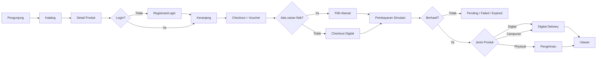

# Product Requirement Document - Inahuy.Shop

| Field | Detail |
|---|---|
| **Author** | Tim Inahuy.Shop |
| **Status** | **Final v1.0 — Validated** |
| **Target Release** | Kuartal 4 (Q4) |
| **Tech Lead** | Mochammad Jihan Isfalana - 4525210110 |
| **Sumber Data** | PRD v0.2, ERD `Online_Shop.erdplus`, dan keputusan validasi D-01 s.d. D-11 |

> **Status dokumen**
> - Seluruh keputusan D-01 s.d. D-11 telah divalidasi dan dipakai sebagai baseline final.
> - Backend tetap **belum ditentukan teknologinya**, yang dikunci hanya keberadaan lapisan backend/API server-side.
> - Produk utama adalah **file unduhan**, dengan dukungan produk fisik secara kondisional pada level varian.
> - Pembayaran menggunakan **simulasi**, bukan integrasi payment gateway produksi.

## 1. Ringkasan & Tujuan

### 1.1 Latar Belakang
Inahuy.Shop adalah platform e-commerce **single-store** yang menjual produk digital berupa file unduhan, seperti e-book dan template. Sistem juga mendukung **varian fisik secara kondisional** apabila pelanggan memilih versi fisik dari produk yang tersedia. Karena itu, data pesanan harus dapat membedakan kebutuhan penyerahan digital dan pengiriman fisik tanpa mencampurkan kedua alur.

### 1.2 Masalah yang Ditujukan
- Pembeli membutuhkan satu tempat untuk menemukan produk, memasukkannya ke keranjang, melakukan checkout, menyelesaikan pembayaran simulasi, dan menerima produk digital.
- Untuk varian fisik, pembeli membutuhkan alamat pengiriman dan informasi pelacakan pesanan.
- Admin toko membutuhkan fasilitas terpusat untuk mengelola katalog, varian, gambar, voucher, pesanan, pembayaran simulasi, dan pengiriman fisik.

### 1.3 Tujuan
1. Pelanggan dapat menjalankan alur: daftar → katalog → keranjang → checkout → pembayaran simulasi → menerima produk digital dan/atau menunggu pengiriman fisik → ulasan.
2. Admin dapat mengelola kategori, produk, varian, gambar, voucher, pesanan, pembayaran, serta pengiriman fisik.
3. ERD dan PRD mempunyai keterlacakan yang konsisten, seluruh FK yang relevan mempunyai relasi yang jelas.
4. Penyerahan produk digital mempunyai struktur data khusus melalui `digital_asset` dan `digital_delivery`.
5. Antarmuka mengikuti **WCAG 2.1 Level AA**.
6. Database menggunakan MySQL dan frontend menggunakan HTML/CSS, Bootstrap 5.3.8, dan JavaScript murni, teknologi backend belum dikunci.

## 2. Target Pengguna & User Story

### 2.1 User Persona
- **Pengunjung:** melihat katalog dan detail produk tanpa login.
- **Pelanggan (`customers`):** mengelola profil/alamat, berbelanja, membayar, mengakses produk digital, melihat riwayat pesanan, dan memberi ulasan.
- **Admin / Penjual (`seller`):** pengelola single-store yang mengelola katalog, pesanan, voucher, pembayaran simulasi, dan pengiriman fisik.

### 2.2 User Stories
| ID | User Story | FR |
|---|---|---|
| US-01 | Sebagai pengunjung, saya ingin mendaftar dengan email dan nomor telepon agar dapat berbelanja. | FR-01 |
| US-02 | Sebagai pelanggan, saya ingin login dan logout agar akun saya terlindungi. | FR-02 |
| US-03 | Sebagai pelanggan, saya ingin mengelola profil dan alamat agar informasi pesanan benar. | FR-03 |
| US-04 | Sebagai pengunjung, saya ingin menelusuri katalog berdasarkan kategori dan pencarian. | FR-07 |
| US-05 | Sebagai pelanggan, saya ingin melihat detail produk, varian, harga, gambar, dan ulasan. | FR-07 |
| US-06 | Sebagai pelanggan, saya ingin menambahkan varian ke keranjang dan mengubah jumlahnya. | FR-09 |
| US-07 | Sebagai pelanggan, saya ingin checkout dengan voucher agar mendapat potongan harga. | FR-10, FR-11 |
| US-08 | Sebagai pelanggan, saya ingin menyelesaikan pembayaran secara simulasi. | FR-12 |
| US-09 | Sebagai pelanggan, saya ingin mendapatkan akses ke file digital setelah pembayaran berhasil. | FR-18 |
| US-10 | Sebagai pelanggan, saya ingin melihat riwayat dan status pesanan. | FR-13 |
| US-11 | Sebagai pelanggan, saya ingin mengulas produk yang telah saya beli. | FR-16 |
| US-12 | Sebagai admin, saya ingin login ke panel admin. | FR-04 |
| US-13 | Sebagai admin, saya ingin mengelola kategori, produk, varian, dan gambar. | FR-05, FR-06, FR-08 |
| US-14 | Sebagai admin, saya ingin membuat dan mengakhiri voucher. | FR-17 |
| US-15 | Sebagai admin, saya ingin memantau dan memperbarui status pesanan serta pembayaran. | FR-14 |
| US-16 | Sebagai admin, saya ingin mengelola pengiriman dan pelacakan untuk pesanan fisik. | FR-15 |

## 3. Persyaratan Fungsional

### 3.1 Akun & Autentikasi
| ID | Deskripsi Fitur | Prioritas | Entitas ERD | Acceptance Criteria |
|---|---|---|---|---|
| FR-01 | Registrasi Pelanggan | P0 | `customers` | Form menerima nama, email, telepon, password, dan `birth_date`, email/telepon unik, password di-hash, `created_at` otomatis, `is_active` aktif secara default, `age` dihitung dari `birth_date`. |
| FR-02 | Login & Logout Pelanggan | P0 | `customers` | Login memakai email + password, akun nonaktif ditolak, pesan gagal tidak membocorkan keberadaan email, logout mengakhiri sesi, rate limit diterapkan. |
| FR-03 | Profil & Buku Alamat | P1 | `customers`, `customer_address` | Pelanggan dapat CRUD alamat, maksimal satu `is_default`, alamat menjadi wajib pada checkout yang mengandung varian fisik. |
| FR-04 | Login Admin | P0 | `seller` | Autentikasi admin terpisah, panel admin hanya dapat diakses setelah login, akun admin dibuat melalui seeding |

### 3.2 Katalog & Varian
| ID | Deskripsi Fitur | Prioritas | Entitas ERD | Acceptance Criteria |
|---|---|---|---|---|
| FR-05 | Kelola Kategori | P1 | `categories` | CRUD kategori, `slug` unik, `parent_id` opsional, sistem mencegah siklus kategori, kategori yang masih dipakai tidak boleh dihapus sembarangan. |
| FR-06 | Kelola Produk, Varian & Gambar | P0 | `products`, `product_variant`, `product_image` | CRUD produk, setiap produk memiliki minimal satu varian, varian memiliki `delivery_type` (`digital` atau `physical`), SKU, harga, stok, dan berat, gambar memiliki `url`, `alt_text`, dan `sort_order`. |
| FR-07 | Katalog & Detail Produk | P0 | `products`, `categories`, `product_variant`, `product_image`, `reviews` | Hanya produk aktif yang tampil, tersedia pagination, filter kategori, pencarian nama/brand, detail menampilkan tipe delivery, varian, harga, ketersediaan, galeri, rating, dan ulasan. |
| FR-08 | Ketersediaan Stok Varian | P0 | `product_variant` | `stock_qty` tidak boleh negatif, pengurangan stok atomik, stok fisik dipakai untuk pemenuhan pengiriman, aturan pembelian tetap divalidasi di server. |

### 3.3 Keranjang, Checkout & Pembayaran
| ID | Deskripsi Fitur | Prioritas | Entitas ERD | Acceptance Criteria |
|---|---|---|---|---|
| FR-09 | Keranjang Belanja | P0 | `carts`, `cart_item` | Satu keranjang per pelanggan, varian sama tidak membuat duplikasi, jumlah ≥1, perubahan tersimpan antar sesi, perubahan keranjang dapat diumumkan ke pembaca layar. |
| FR-10 | Checkout & Pembuatan Pesanan | P0 | `orders`, `order_item`, `customer_address` | Order dibuat dari keranjang, `order_number` unik, `product_name_snapshot` dan `unit_price` disimpan, `line_total`, `subtotal`, dan `grand_total` dihitung **di server** dan **disimpan**, seluruh proses order/item/stok/keranjang berada dalam satu transaksi database, `shipping_address_id` hanya diisi bila pesanan memuat varian fisik, `shipping_cost` = 0 untuk pesanan digital murni. |
| FR-11 | Voucher saat Checkout | P1 | `vouchers`, `order_vouchers` | Kode divalidasi terhadap masa berlaku, minimum belanja, dan usage limit, diskon disimpan pada order, grand total tidak boleh negatif, maksimal **1 voucher per pesanan**. |
| FR-12 | Pembayaran Simulasi | P0 | `payments` | Setiap order mempunyai record pembayaran, `method` menunjukkan metode simulasi, `amount` = `grand_total`, status awal `pending`, sistem dapat mensimulasikan `success`, `failed`, atau `expired`, `payment_reference` dapat dipakai sebagai referensi simulasi, tidak ada callback gateway eksternal. |

### 3.4 Pesanan, Pengiriman, Penyerahan Digital & Ulasan
| ID | Deskripsi Fitur | Prioritas | Entitas ERD | Acceptance Criteria |
|---|---|---|---|---|
| FR-13 | Riwayat & Detail Pesanan | P0 | `orders`, `order_item`, `payments`, `digital_delivery`, `shipments` | Pelanggan hanya melihat pesanannya sendiri, detail menampilkan item snapshot, diskon, total, pembayaran, akses digital, dan pengiriman bila ada. |
| FR-14 | Kelola Pesanan & Pembayaran | P0 | `orders`, `order_item`, `payments` | Admin dapat mencari/filter order, status hanya mengikuti alur Lampiran E, perubahan nilai tidak boleh menghasilkan order tanpa item atau pembayaran. |
| FR-15 | Pengiriman & Pelacakan Fisik | P1 — kondisional | `shipments`, `shipment_track`, `customer_address` | Hanya digunakan bila order memiliki varian `physical`, admin mengisi kurir, layanan, nomor tracking, dan tanggal kirim, pelanggan melihat riwayat tracking. |
| FR-16 | Ulasan Produk | P1 | `reviews`, `order_item` | Hanya pelanggan yang memiliki `order_item` yang sah dan pesanan telah dibayar/selesai, satu `order_item` maksimal satu ulasan, `rating` 1–5, `customer_id` dan `product_id` **tidak disimpan** di `reviews` karena diturunkan dari `order_item`. |
| FR-17 | Kelola Voucher | P1 | `vouchers` | Admin dapat CRUD voucher, voucher yang telah pernah digunakan tidak dihapus sehingga histori order tetap konsisten. |
| FR-18 | Penyerahan Produk Digital | P0 | `digital_asset`, `digital_delivery`, `order_item`, `product_variant` | Setelah pembayaran sukses, setiap aset digital yang menjadi bagian `order_item` dapat diakses pelanggan, `download_token` unik/terbatas, `expires_at` dan `download_count` dicatat, akses hanya untuk pemilik order. |

## 4. Persyaratan Non-Fungsional

### 4.1 Performa
- API baca sederhana ≤ 200 ms pada beban normal.
- Proses checkout ≤ 1 detik pada lingkungan pengujian normal.
- LCP halaman katalog ≤ 2,5 detik sebagai target.
- Kolom pencarian dan foreign key utama diberi indeks.

### 4.2 Keamanan
- Password menggunakan hash satu arah (bcrypt/argon2id), bukan plaintext.
- HTTPS digunakan saat data berpindah melalui jaringan.
- Query database menggunakan parameterized query.
- Output di-escape untuk mencegah XSS.
- Otorisasi diperiksa di server.
- Cookie sesi menggunakan `HttpOnly`, `Secure`, dan `SameSite` bila mekanisme sesi berbasis cookie digunakan.
- Rate limiting diterapkan pada login.
- Token akses digital memiliki batas waktu.
- Harga dan seluruh total dihitung dari data server, bukan input browser.
- Data pribadi diproses secara minim dan sesuai kebutuhan sistem. **UU No. 27 Tahun 2022 tentang Pelindungan Data Pribadi berstatus berlaku** dan menjadi acuan kepatuhan data pribadi pada lingkup proyek.

### 4.3 Skalabilitas
Target MVP: **100 pengguna aktif bersamaan** dengan pagination dan indeks pada query utama.

### 4.4 Ketersediaan
Target MVP: **best-effort ≥ 99%** tanpa SLA formal.

### 4.5 Aksesibilitas
Target: **WCAG 2.1 Level AA**.

Kriteria yang menjadi perhatian utama:
- 1.1.1 teks alternatif pada gambar.
- 1.3.1 struktur dan label semantik.
- 1.4.3 kontras teks minimum.
- 1.4.4 resize teks dan 1.4.10 reflow.
- 2.1.1 akses keyboard.
- 2.4.7 fokus terlihat.
- 3.3.1–3.3.3 identifikasi dan perbaikan error form.
- 4.1.2 nama/peran/nilai komponen.
- 4.1.3 pesan status.

Bootstrap menjadi fondasi komponen, tetapi tidak dianggap sebagai jaminan kepatuhan otomatis.

### 4.6 Integritas Data & Kompatibilitas
- MySQL InnoDB dan `utf8mb4`.
- Nilai uang menggunakan `DECIMAL`.
- Foreign key riwayat transaksi menggunakan aturan referensial yang tidak merusak histori order.
- Timestamp konsisten, mata uang IDR, bahasa antarmuka Indonesia.
- Browser modern dan desain mobile-first.
- **Bootstrap 5.3.8 terverifikasi** pada repositori/dokumentasi resmi Bootstrap.

## 5. Batasan Cakupan

### In Scope
- Single-store e-commerce.
- Produk digital file download.
- Varian physical secara kondisional.
- Customer account dan address.
- Katalog, kategori, keranjang, checkout, voucher.
- Pembayaran simulasi.
- Penyerahan file digital.
- Pengiriman manual dan tracking untuk pesanan fisik.
- Review berbasis `order_item`.

### Out of Scope
- Marketplace multi-penjual.
- Payment gateway produksi.
- Refund, retur, dan dispute.
- Wishlist, chat, notifikasi WhatsApp/email.
- Guest checkout.
- Login sosial dan reset password melalui email.
- Integrasi API kurir otomatis dan perhitungan ongkir real-time.
- Multi-currency, loyalty, bundling, subscription.
- Mobile native application.
- DRM tingkat lanjut.

## 6. Desain & Arsitektur

### 6.1 Teknologi
| Komponen | Status | Keterangan |
|---|---|---|
| MySQL | Ditetapkan | Database utama, InnoDB + `utf8mb4`. |
| HTML + CSS | Ditetapkan | Struktur dan styling dasar. |
| Bootstrap 5.3.8 | Ditetapkan & terverifikasi | Framework UI responsif. |
| JavaScript murni | Ditetapkan | Logika sisi-klien dan komunikasi API. |
| Backend / REST API | **Belum ditentukan** | Lapisan server-side wajib ada, teknologi implementasi belum dikunci. |
| Payment Gateway | Tidak digunakan | Pembayaran bersifat simulasi. |
| Penyimpanan file digital | Belum ditentukan | `digital_asset.file_url` menunjuk lokasi aset yang digunakan sistem. |
| Hosting & domain | Belum ditentukan | Ditentukan pada tahap implementasi/deployment. |

### 6.2 Arsitektur Konseptual
```text
Browser
HTML + CSS + Bootstrap 5.3.8 + JavaScript
                │
                │ HTTPS / JSON / fetch()
                ▼
        Backend / REST API
        (teknologi belum final)
                │
                │ query berparameter + transaksi
                ▼
          MySQL InnoDB
                │
        ┌───────┴────────┐
        ▼                ▼
 Digital Asset      Order / Shipment
 Storage             Data
```

### 6.3 User Flow Utama


### 6.4 Inventaris Halaman
| Kode | Halaman | Peran | FR |
|---|---|---|---|
| P-01 | Beranda & katalog | Publik | FR-07 |
| P-02 | Detail produk | Publik | FR-07, FR-16 |
| P-03 | Registrasi | Publik | FR-01 |
| P-04 | Login | Publik | FR-02 |
| P-05 | Keranjang | Pelanggan | FR-09 |
| P-06 | Checkout | Pelanggan | FR-10, FR-11, FR-03 |
| P-07 | Pembayaran simulasi | Pelanggan | FR-12 |
| P-08 | Riwayat pesanan | Pelanggan | FR-13 |
| P-09 | Detail pesanan + digital delivery + tracking fisik | Pelanggan | FR-13, FR-15, FR-16, FR-18 |
| P-10 | Profil & alamat | Pelanggan | FR-03 |
| A-01 | Login admin | Admin | FR-04 |
| A-02 | Kelola kategori | Admin | FR-05 |
| A-03 | Kelola produk, varian, gambar | Admin | FR-06, FR-08 |
| A-04 | Kelola voucher | Admin | FR-17 |
| A-05 | Daftar pesanan | Admin | FR-14 |
| A-06 | Detail pesanan, pembayaran & pengiriman | Admin | FR-14, FR-15 |

## 7. Metrik Keberhasilan
| Metrik | Target | Cara Ukur |
|---|---|---|
| Kelengkapan fitur | 100% FR P0 lulus acceptance criteria | Checklist pengujian |
| Keterlacakan ERD | 19/19 entitas terpetakan ke minimal satu FR | Lampiran A |
| Aksesibilitas | 0 pelanggaran serious/critical pada halaman utama, Lighthouse Accessibility ≥ 90 sebagai indikator | axe + Lighthouse + keyboard/manual screen reader |
| Keberhasilan checkout | ≥ 95% skenario normal selesai tanpa error | End-to-end test |
| Efisiensi alur beli | Detail produk → pembayaran ≤ 4 layar utama | Uji alur |
| Integritas data | 0 total tidak konsisten, 0 stok negatif, 0 order tanpa item/pembayaran | Query pemeriksa |
| Performa | LCP ≤ 2,5 detik, API baca ≤ 200 ms | Lighthouse + uji sederhana |
| Keamanan dasar | 0 temuan high severity pada SQLi, XSS, dan akses data lintas pelanggan | Checklist pengujian |

## 8. Risiko & Mitigasi
| Risiko | Dampak | Mitigasi |
|---|---|---|
| Logika digital dan fisik tercampur | Tinggi | Gunakan `product_variant.delivery_type` dan aturan checkout kondisional. |
| Tidak ada wadah data penyerahan digital | Tinggi | `digital_asset` + `digital_delivery`. |
| FK tanpa relasi jelas | Sedang | Tambahkan relasi `orders` → `customer_address` dan `order_item` → `product_variant`, FK review yang redundan dihapus. |
| Harga/total dimanipulasi dari browser | Tinggi | Hitung seluruh nilai di server dalam satu transaksi. |
| Race condition stok/voucher | Sedang–Tinggi | Transaksi database dan update atomik/penguncian baris sesuai implementasi backend. |
| Token file digital dibagikan | Sedang | Token unik, kedaluwarsa, dan pembatasan jumlah akses. |
| Pembayaran simulasi disalahgunakan sebagai seolah-olah payment gateway | Sedang | Labelkan jelas sebagai simulasi dan tanpa callback gateway eksternal. |
| UI tidak memenuhi WCAG | Sedang | Gunakan WCAG 2.1 AA sebagai acceptance baseline dan lakukan pengujian sejak UI/UX. |
| Teknologi backend belum final | Sedang | Pertahankan kontrak REST/API dan SQL sebagai batas arsitektur, pemilihan bahasa/framework ditentukan saat implementasi. |

## Lampiran A — Keterlacakan Entitas ERD → Fitur

| # | Entitas | FR Utama |
|---|---|---|
| 1 | `customers` | FR-01, FR-02, FR-03 |
| 2 | `customer_address` | FR-03, FR-10, FR-15 |
| 3 | `seller` | FR-04 |
| 4 | `categories` | FR-05, FR-07 |
| 5 | `products` | FR-06, FR-07 |
| 6 | `product_variant` | FR-06, FR-07, FR-08, FR-09, FR-18 |
| 7 | `product_image` | FR-06, FR-07 |
| 8 | `carts` | FR-09 |
| 9 | `cart_item` | FR-09 |
| 10 | `orders` | FR-10, FR-13, FR-14 |
| 11 | `order_item` | FR-10, FR-13, FR-16, FR-18 |
| 12 | `payments` | FR-12, FR-13, FR-14 |
| 13 | `vouchers` | FR-11, FR-17 |
| 14 | `order_vouchers` | FR-11 |
| 15 | `shipments` | FR-15 |
| 16 | `shipment_track` | FR-15 |
| 17 | `reviews` | FR-07, FR-16 |
| 18 | `digital_asset` | FR-18 |
| 19 | `digital_delivery` | FR-13, FR-18 |

## Lampiran B — Atribut Turunan & Tersimpan

| Entitas | Atribut | Status | Aturan |
|---|---|---|---|
| `customers` | `age` | Turunan | Dihitung dari `birth_date`, tidak disimpan. |
| `orders` | `subtotal` | Turunan tersimpan | Σ `order_item.line_total`, dihitung server lalu disimpan sebagai snapshot transaksi. |
| `orders` | `grand_total` | Turunan tersimpan | `subtotal - discount_amount + shipping_cost`, dihitung server lalu disimpan. |
| `order_item` | `line_total` | Turunan tersimpan | `unit_price × quantity`, dihitung server lalu disimpan. |
| `reviews` | `customer_id`, `product_id` | Tidak disimpan | Diturunkan melalui `order_item` → `orders`/`product_variant` → `products`. |

## Lampiran C — Perbaikan ERD yang Telah Diselesaikan

| ID Temuan | Penyelesaian Final |
|---|---|
| T-1 | Model sekarang mendukung produk utama digital dan varian fisik secara kondisional melalui `product_variant.delivery_type`. |
| T-2 | Ditambahkan `digital_asset` dan `digital_delivery` untuk aset dan penyerahan produk digital. |
| T-3 | Relasi `orders` → `customer_address` dan `order_item` → `product_variant` ditambahkan. `reviews.customer_id` dan `reviews.product_id` dihapus sesuai D-08. |
| T-4 | `seller` tetap digunakan sebagai akun admin toko pada model single-store. Tidak ditambahkan relasi seller-product karena desain tidak memakai `seller_id` operasional. |
| T-5 | `reviews` hanya menyimpan `order_item_id` sebagai penghubung ke transaksi pembelian. |
| T-6 | `product_image.alt_text` ditambahkan untuk mendukung WCAG 1.1.1. |
| T-7 | `age` tetap turunan, `line_total`, `subtotal`, dan `grand_total` disimpan sebagai nilai transaksi yang dihitung server. |
| T-8 | Kunci komposit yang diperlukan tetap diwajibkan pada `cart_item` dan `order_vouchers`. |
| T-9 | Aturan voucher memakai `valid_until` dan `usage_limit`, status aktif dapat ditentukan dari kondisi waktu tanpa menambah entitas baru. |
| T-10 | Nilai status disepakati pada Lampiran E. |
| T-11 | Penamaan `district` dipertahankan agar tidak mengubah sumber tanpa keputusan tambahan, belum menjadi blocker. |
| T-12 | Audit trail perubahan status tidak ditambahkan pada baseline tugas kuliah, menjadi pengembangan berikutnya bila dibutuhkan. |

## Lampiran D — Keputusan Validasi Final

| ID | Keputusan | Status |
|---|---|---|
| D-01 | Produk dijual sebagai file unduhan (e-book/template) | **Valid** |
| D-02 | Pengiriman fisik digunakan ketika pelanggan membeli varian fisik | **Valid** |
| D-03 | Entitas penyerahan digital ditambahkan ke ERD | **Valid** |
| D-04 | Backend belum ditentukan, hanya lapisan server/API yang diasumsikan wajib | **Valid** |
| D-05 | Pembayaran menggunakan simulasi | **Valid** |
| D-06 | `line_total`, `subtotal`, `grand_total` disimpan dan dihitung server dalam satu transaksi | **Valid** |
| D-07 | Toko tunggal / single-store | **Valid** |
| D-08 | `customer_id` dan `product_id` review diturunkan dari `order_item` dan tidak disimpan | **Valid** |
| D-09 | Nilai status memakai Lampiran E | **Valid** |
| D-10 | Angka non-fungsional dan metrik diterima | **Valid** |
| D-11 | WCAG 2.1 Level AA | **Valid** |

## Lampiran E — Nilai Status Final

| Field | Nilai Final | Aturan |
|---|---|---|
| `orders.status` | `pending_payment`, `paid`, `processing`, `shipped`, `completed`, `cancelled`, `expired` | `processing`/`shipped` hanya relevan untuk order yang memiliki varian fisik. Order digital dapat berpindah dari `paid` ke `completed` setelah akses digital dibuat. |
| `payments.status` | `pending`, `success`, `failed`, `expired` | Untuk simulasi pembayaran. `refunded` tidak digunakan. |
| `payments.method` | `simulation` | Tidak bergantung pada payment gateway eksternal. |
| `vouchers.discount_type` | `percentage`, `fixed` | Maksimal 1 voucher per order. |
| `shipment_track.status` | `picked_up`, `in_transit`, `out_for_delivery`, `delivered` | Hanya untuk order physical. |
| `product_variant.delivery_type` | `digital`, `physical` | Menentukan alur penyerahan/pengiriman. |

## Referensi Eksternal Terverifikasi

1. **Bootstrap 5.3.8** — repositori resmi Bootstrap mencantumkan v5.3.8 sebagai rilis dan sumber instalasi resmi menyediakan paket `bootstrap@5.3.8`.
   - https://github.com/twbs/bootstrap/releases
   - https://github.com/twbs/bootstrap/blob/main/README.md
2. **UU No. 27 Tahun 2022 tentang Pelindungan Data Pribadi** — JDIH BPK mencatat UU ini berlaku sejak 17 Oktober 2022 dan berstatus **Berlaku**.
   - https://peraturan.bpk.go.id/Details/229798/uu-no-27-
